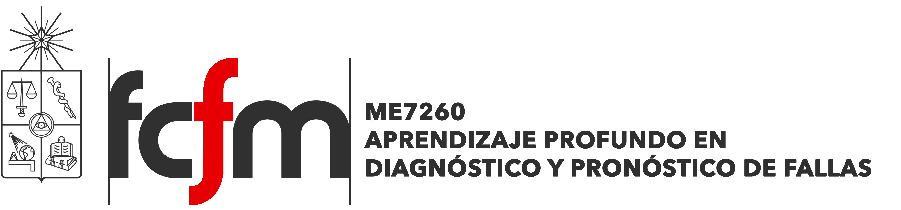

Este repositorio contiene los talleres prácticos y el material complementario del curso ME7260 Aprendizaje Profundo en Diagnóstico y Pronóstico de Fallas.

## Google Colab
Al desarrollar proyectos de Deep Learning, la mayor limitante suele ser el poder computacional disponible (CPU/GPU) para ejecutarlos. [**Google Colaboratory**](https://colab.research.google.com/notebooks/welcome.ipynb) es un entorno de Jupyter notebook gratuito que se ejecuta completamente en la nube. La plataforma permite tanto escribir como ejecutar código, y solo se requiere de una cuenta google.

https://colab.research.google.com/notebooks/welcome.ipynb

Dentro de este repositorio podrá encontrar los notebooks (\*.ipynb) de los distintos workshops a realizar a lo largo del curso. Descárguelos y ábralos dentro de su propia sesión de Colab.

## Clonar GitHub
En caso de requerir importar archivos y/o elementos de este repositorio a un entorno de Google Colab, puede clonarlo directamente mediante:

`! git clone https://github.com/cherrerab/deeplearningfallas.git`

Si el repositorio se ha clonado correctamente, notará que en la carpeta de archivos `/content` se habrá creado el directorio `deeplearningfallas`. Para utilizar este directorio dentro de la sesión, utilice el siguiente comando:

`%cd /content/deeplearningfallas`

De este modo será posible importar las funciones y utilidades contenidas dentro del repositorio:

`>>> from utils._tools import *`

## Tutorial Data Manipulation
Numpy y Pandas son librerías utilizadas extensamente en la ciencia de datos y el Machine Learning. Fundamentalmente, ambas están orientadas a la manipulación de arreglos multidimensionales y bases de datos, por supuesto, cada una con sus estructuras de datos y operaciones particulares. En este tutorial aprenderá las funcionalidades básicas de estas librerías que le permitirán abordar los próximos workshops del curso.

## Workshop MFPT Data Manipulation
La Machinery Failure Prevention Technology es una organización orientada a la integración y al intercambio de información técnica entre distintas comunidades científicas y de ingeniería, con el fin de avanzar en el estudio de los mecánismos de falla. En este workshop trabajaremos con su Bearing Fault Dataset, el cual contiene mediciones experimentales de vibración de rodamientos de bola bajo distintos estados de daño.

Mediante este workshop aprenderá el framework clásico de exploración, análisis y preprocesamiento de bases de datos. Estos pasos son fundamentales para desarrollar con éxito cualquier proyecto de Data Science y Deep Learning.

## Workshop MFPT Classification Model
Continuando con el procesamiento de datos del workshop anterior, en esta oportunidad aprenderá como construir y configurar un modelo de clasificación de Deep Learning mediante TensorFlow y Keras. Entender el framework de estas herramientas le permitirá seguir avanzando con modelos y arquitecturas de mayor complejidad a medida que estas sean introducidas en el curso.

## Workshop Defective PV Module Cells
Entre los métodos que permiten llevar a cabo una inspección visual de la condición de las celdas solares, las imágenes de electroluminiscencia (EL) proveen de imágenes de alta resolución que posibilitan la detección de defectos de menor tamaño en la superficie de las celdas. En este workshop dispondremos de un dataset público de imágenes de electroluminiscencia de celdas solares fotovoltaicas en distintos estado de daño con el cual desarrollaremos y entrenaremos un modelo de diagnóstico en base a redes convolucionales (CNN) mediante TensorFlow y Keras.

## Workshop ELPV Transfer Learning
En ocasiones, no resulta del todo eficiente entrenar un modelo convolucional desde cero pues es posible que para alcanzar una mejor abstracción en la extracción de features dentro del modelo se requieran una mayor cantidad de datos e incluso un mayor tiempo de entrenamiento, lo que no siempre será factible. El Transfer Learning consiste en adaptar modelos previamente desarrollados para facilitar el aprendizaje sobre un nuevo problema de interés, del mismo modo en que alguien que sabe guitarra podría aprender a tocar bajo más rapidamente que alguien sin ninguna experiencia musical. Así, en este workshop volveremos a usar el dataset de electroluminiscencias de celdas solares fotovoltaicas para el desarrollo de un modelo convolucional clasificación mediante transfer learning.

## Workshop C-MAPSS Dataset
El Comercial Modular Aero-Propulsion System Simulation (C-MAPSS) es un software desarrollado por NASA como ambiente de simulación de motores de reacción tipo turbofán. Así, esta herramienta permite la implementación y evaluación de algoritmos de control y diagnóstico sobre la operación de un motor turbofán de 90.000 lbf de propulsión. En este workshop implementaremos un modelo recurrente mediante `tensorflow` y `keras` para la predicción del RUL de turbofanes de aviación, a partir de la serie temporal de mediciones de sus sensores.

